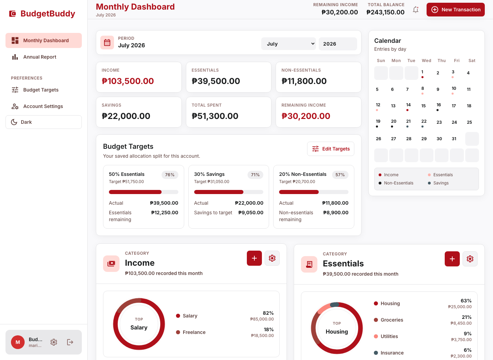

# BudgetBuddy

[](https://github.com/ostenmatrixx/budget-tracker/actions/workflows/ci.yml)
[](https://github.com/ostenmatrixx/budget-tracker/actions/workflows/codeql.yml)

BudgetBuddy is a privacy-conscious personal finance PWA for tracking income, essentials, savings, and discretionary spending. It combines a responsive React dashboard with Supabase authentication and owner-scoped Postgres data, and is engineered for a public multi-user beta on Vercel.



## What it does

- Tracks income, bills, savings, and non-essential spending with custom subcategories
- Shows monthly summaries, category charts, a calendar, a daily log, and annual reports
- Supports editable budget allocations, with 50/30/20 defaults
- Formats dates and money from each account's currency, locale, and timezone settings
- Handles confirmation, recovery, password changes, and password-reauthenticated account deletion
- Exports fresh owner-scoped data as versioned JSON or spreadsheet-safe RFC-4180 CSV
- Installs as a PWA while keeping financial records out of browser caches and background sync
- Preserves loaded data when offline, blocks writes, and provides explicit update and retry actions

## Production engineering

- Supabase Row Level Security across all four owner-scoped tables, backed by 60 pgTAP assertions
- Idempotent transaction creation and optimistic concurrency protection for edits and deletes
- Year-bounded dashboard reads, paginated exports, and an owner-derived lifetime balance RPC
- Accessible native-dialog infrastructure, keyboard flows, live status announcements, and axe checks
- Privacy-minimal, production-only Sentry errors with private source maps and no session replay
- Strict Vercel security headers, self-hosted fonts, explicit service-worker caching rules, and public security contact metadata
- Reproducible Node 24 builds, dependency auditing, coverage thresholds, three-browser Playwright smoke tests, and Lighthouse budgets
- CodeQL, dependency review, Dependabot, encrypted-backup automation, staging validation, and read-only production health checks

The codebase provides production-grade controls, but a real launch still requires the hosted configuration and staging evidence in the [production runbook](docs/production-runbook.md). Repository automation cannot prove that external Supabase, Vercel, SMTP, Turnstile, Sentry, DNS, or administrator settings are correct.

## Architecture

The browser receives only public Supabase, Turnstile, and optional Sentry configuration. It talks directly to Supabase Auth and PostgREST; database RLS is the authorization boundary. The only privileged runtime is the authenticated `delete-account` Supabase Edge Function, whose service-role key stays server-side.

| Layer                | Technology                                         | Responsibility                                        |
| -------------------- | -------------------------------------------------- | ----------------------------------------------------- |
| Client               | React 19, TypeScript, Vite, Tailwind CSS           | Dashboard, validation, settings, exports, and PWA UX  |
| Identity and data    | Supabase Auth, Postgres, PostgREST, RLS            | Sessions and owner-scoped persistence                 |
| Privileged operation | Supabase Edge Function                             | Reauthenticated hard account deletion                 |
| Hosting              | Vercel                                             | Static delivery, previews, and security headers       |
| Assurance            | Vitest, Playwright, axe, pgTAP, Lighthouse, CodeQL | Correctness, accessibility, policy, and release gates |

See [Architecture](docs/architecture.md) and the [Security review](docs/security-review.md) for trust boundaries and documented residual risks.

## Local development

Use Node 24 and npm:

```bash
npm ci
cp .env.example .env
npm run dev
```

Required public browser configuration:

```env
VITE_SUPABASE_URL=https://your-project-ref.supabase.co
VITE_SUPABASE_ANON_KEY=your-public-anon-or-publishable-key
VITE_TURNSTILE_SITE_KEY=your-public-cloudflare-turnstile-site-key
VITE_SENTRY_DSN=your-optional-public-sentry-dsn
```

Never expose a Supabase service-role key, database URL, Sentry upload token, SMTP credential, or Turnstile secret through a `VITE_*` variable.

## Quality gates

```bash
npm run check          # formatting, lint, coverage, type-safe production build
npm run test:unit      # Vitest suite
npm run test:coverage  # safety-critical coverage, minimum 70%
npm run test:e2e       # Chromium, Firefox, and mobile WebKit
npm run test:db        # local Supabase pgTAP policy suite (requires Docker)
npm audit --audit-level=high
```

Pull requests run the deterministic browser suite against mocked Supabase. Authenticated CRUD and RLS validation use an isolated staging Supabase project before release; production credentials and data must never enter pull-request jobs.

## Supabase and deployment

The checked-in migrations create `transactions`, `budget_preferences`, `transaction_subcategories`, and `user_settings`, their constraints and owner policies, request idempotency, transaction versions, and the balance RPC.

Deploy additively in this order:

1. Back up production and validate an encrypted restore drill.
2. Apply migrations and deploy the Edge Function to staging.
3. Configure staging Auth, SMTP, Turnstile, redirects, origins, rate limits, and monitoring.
4. Deploy the frontend and pass staging Auth/RLS/CRUD, export, deletion, accessibility, PWA, CSP, and cache checks.
5. Promote the database, function, hosted configuration, and frontend to production in that order.
6. Verify public headers and health endpoints, then retain the release evidence.

Use separate Supabase projects and Vercel variables for Preview and Production. Full commands, rollback boundaries, and operator checks are in the [production runbook](docs/production-runbook.md).

## Security, privacy, and operations

- Report vulnerabilities through [GitHub private security advisories](https://github.com/ostenmatrixx/budget-tracker/security/advisories/new); see [SECURITY.md](SECURITY.md).
- Review the [incident response](docs/incident-response.md), [data retention](docs/data-retention.md), and [backup and restore](docs/backup-and-restore.md) procedures before launch.
- Replace the included privacy and terms templates with owner-approved text that accurately reflects configured providers and applicable law.
- Enable protected branches, required checks, private vulnerability reporting, secret scanning, push protection, and administrator MFA in hosted consoles.

## Scope

Receipt scanning, recurring transactions, CSV import, bank synchronization, alerts, persistent offline financial storage, and background mutation queues are intentionally deferred until the production-beta foundation has been deployed and observed under real use.

Contributions are welcome through the process in [CONTRIBUTING.md](CONTRIBUTING.md). This repository does not yet declare an open-source license; choose and add one before inviting third-party code reuse.
